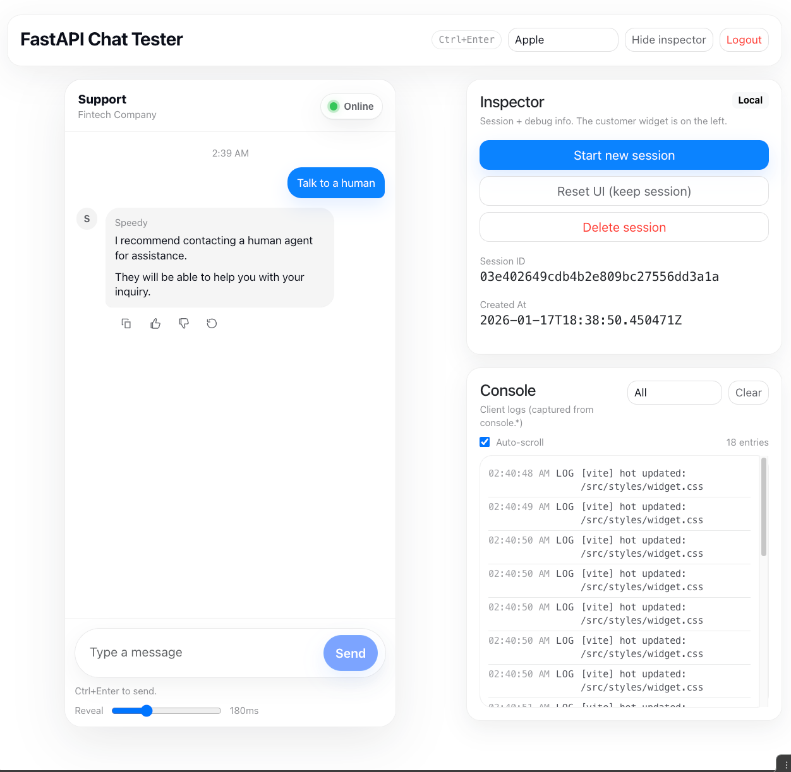
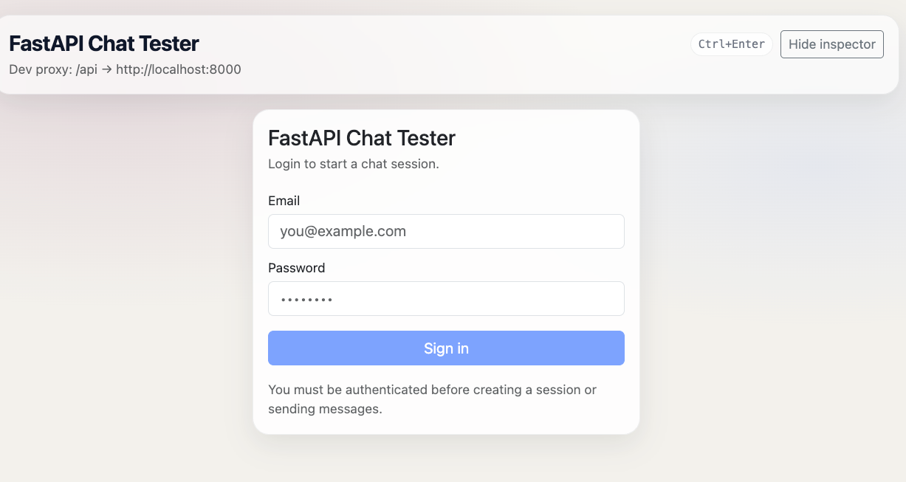

# FastAPI Chatbot Widget

A lightweight **frontend testing widget** for FastAPI chatbot backends.

If you’re building a chatbot API in **FastAPI** and want a clean way to **see how it behaves in a real UI**—without spending time on frontend work—this project is for you.

This widget lets you:

- Test authentication flows (JWT / OAuth-style login)
- Send chat messages (including **streaming responses**)
- Submit feedback (👍 / 👎) per assistant message
- Inspect sessions and debug IDs
- Validate your API contract end-to-end

It’s intentionally **simple, local-first, and backend-driven**.

---

## What this is (and isn’t)

**This is:**

- A developer-facing chat UI to test FastAPI chatbot APIs
- A drop-in frontend you can point at your own backend
- Useful for debugging, demos, and backend iteration

**This is not:**

- A production chat widget
- A hosted service
- Opinionated about your LLM, framework, or infra

---

## Screenshots

### Chat UI



### Login UI


(Images are included in the repo for reference.)

---

## Features

- 🔐 **JWT-based login support**
- 💬 **Chat UI with streaming responses**
- 👍👎 **Per-message feedback**
- 🧪 **Inspector panel**
  - Create / delete sessions
  - View session IDs
  - Reset UI state

- ⚡ Built with **React + Vite**
- 🔌 Backend-configurable via environment variables

---

## How it works (high level)

The frontend talks to your FastAPI backend through a **well-defined HTTP API contract**.

You point the widget at your backend URL, and it:

1. Authenticates via a login endpoint
2. Creates chat sessions
3. Sends messages (streaming is supported and recommended)
4. Sends feedback for assistant messages

No frontend customization is required beyond the API base URL.

---

## Configuration

Create a local environment file:

```bash
cp .env.example .env
```

Example `.env.example`:

```env
VITE_API_BASE_URL=/api
```

- Use `/api` for local development with Vite proxy
- Or set it to a full URL, e.g. `https://your-backend.com/api`

---

## Required Backend API Contract

Your FastAPI backend must expose the following endpoints.

### Authentication

```http
POST /auth/login
Content-Type: application/x-www-form-urlencoded
```

**Request**

```
username=...
password=...
```

**Response**

```json
{
  "access_token": "JWT_TOKEN",
  "token_type": "bearer"
}
```

---

### Create Chat Session

```http
POST /v1/chat/session
Authorization: Bearer <token>
```

**Response**

```json
{
  "session_id": "string",
  "created_at": "ISO-8601 timestamp"
}
```

---

### Send Message (Streaming – recommended)

```http
POST /v1/chat/session/{session_id}/message:stream
Authorization: Bearer <token>
```

**Headers returned**

```
x-message-id: <assistant_message_id>
x-trace-id: <optional_trace_id>
```

**Body**

- Plain text (streamed or full)

This widget currently **uses the streaming endpoint by default**.

---

### Send Feedback

```http
POST /v1/chat/session/{session_id}/feedback
Authorization: Bearer <token>
```

**Body**

```json
{
  "feedback": "thumbs_up" | "thumbs_down",
  "message_id": "assistant_message_id",
  "reason": null,
  "metadata": {}
}
```

> Internally, this widget locks feedback per message so users can’t submit twice.

---

## Local Development

```bash
npm install
npm run dev
```

By default, Vite proxies `/api` to `http://localhost:8000`.

You can change this in `vite.config.js` if needed.

---

## Notes

- The widget stores JWTs in `localStorage` (developer tooling only)
- Streaming is handled as plain text for simplicity
- Feedback integration is backend-agnostic
  (Langfuse works well, but is **not required**)

---

## Why this exists

This project exists to **remove frontend friction** when building FastAPI chatbot backends.

You can:

- Iterate on your API
- Validate streaming behavior
- Test auth, sessions, and feedback
- Demo your backend without building a UI

That’s it.

